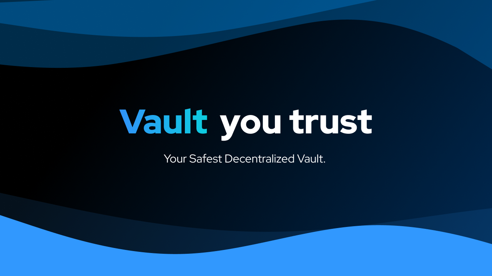

  
    
  
  
  

 

# 🚀 Vault3 beta

Vault3 is a decentralised vault to store all your private data, secured on the blockchain. Use an image as a key to your vault!

Check out vault3 today https://vault3.vercel.app

## 💡 The Idea

In this modern world of technology, our data is in the hands of many big companies. Web 3.0 introduces the concept of decentralisation, in short, the flow and storage of data, without the need of any central authority.

And Vault3 is based on the idea of decentralisation to make the most secure personal vault for others.

## ⭐ Features

- Use an image as a private key for your vault.
- All kind of files supported.
- Store your passwords
- Get your Data Stats
- Based on blockchain technology

## 🌠 Uses

- NextJS [Frontend Framework]
- Chakra UI [UI Framework]
- Third Web
- Supabase [to store hashed data]
- External Javascript Libraries

## Contracts

Key Registrar https://mumbai.polygonscan.com/address/0x9d0DD96DbD54160de4bBe4B198529112727A9546  
User Vault https://mumbai.polygonscan.com/address/0xd0D33121fDA87Abf87BbF428D27b429a1C771eEB
